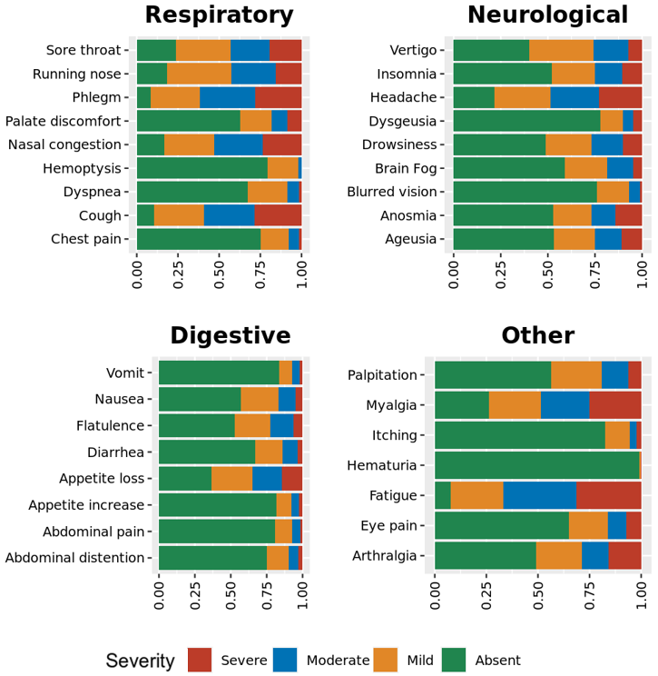
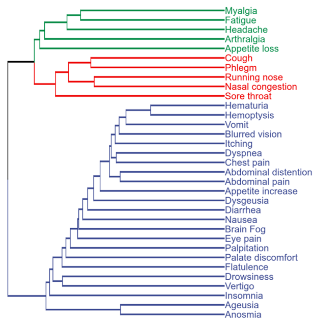
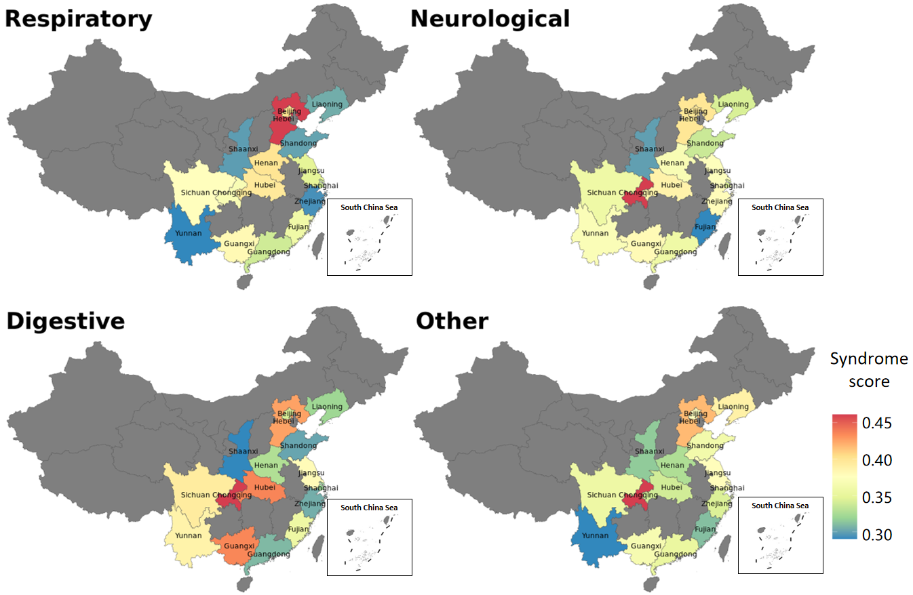
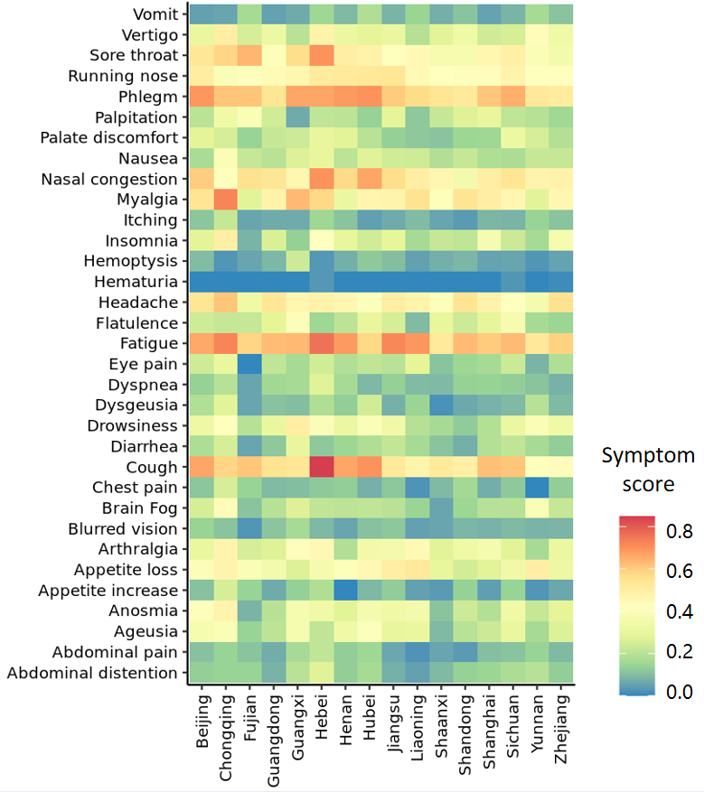

A COVID-19 survey in China after ending of restriction.
=============================================

123

23

=============================================

In Dec 2022, the COVID-19 restriction was end.

We conduct this on-line survey to measure the characteristics to measure the characteristics of COVID-19 patients in China. 

Symptom spectrum of COVID-19:

Cluster of COVID-19 symptoms:

Regional distribution of COVID-19 syndromes:

Regional distribution of COVID-19 symptoms:

.. toctree::
   :maxdepth: 2
   :caption: Contents:

Data and code
=======================
Our questionaire data is available and the analysis code is also provied. 
.. toctree::
   :maxdepth: 1
   Data
   Code

Comments and feedbacks
=======================
Feel free to contact me via zhanghaoyang0@hotmail.com
